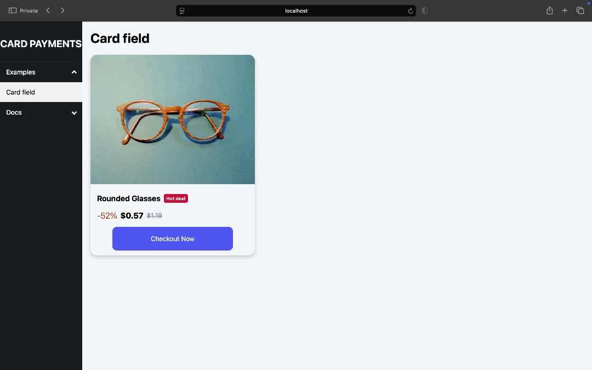

# Card field example

This example demonstrates how to integrate the Revolut Card field SDK into your checkout process using a two-tiered approach that separates the client-side presentation from the backend logic. Explore this simplified demo to observe the code and SDK configuration you need to start accepting payments with Revolut Card field.

The example inlcudes a simple Node.JS server app using the Merchant API, paired with a simple HTML client checkout experience.

**You only need to run the server component - the server handles order creation and serves the client checkout page.**

> [!TIP]
> For testing we suggest configuring the demo with your Sandbox API keys.



## Architecture

- **Backend (Server)**
  - Creates orders and handles tokens needed to initialise the payment session.
  - Serves the client-side checkout page.
- **Frontend (Client)**
  - A simple HTML page that renders the Revolut Pay button using the token provided by the server.

> [!NOTE]
> For further details about the code and the SDK's behaviour, please refer to the inline comments in the code.

### Order management

In this example, the order management process is left out, as it is entirely up to you to implement according to your specific requirements. For guidance and inspiration, please refer to our [`revolut-pay-example`](../revolut-pay-example), which demonstrates one way to handle order creation and management.

Additionally, check out our [API explorer](https://developer.revolut.com/docs/merchant/merchant-api) for code examples in various languages to help you integrate and develop with the Revolut Merchant API.

## Requirements

- Revolut Merchant API keys
- Node.js 16 or later

## Project setup
### 1. Installation

1. Start by cloning the repository:

    ```sh
    git clone git@github.com:revolut-engineering/revolut-checkout-example.git
    ```

1. Open the repository folder:

    ```sh
    cd revolut-checkout-example/card-field-example/server
    ```

1. Install dependencies with your package manager:

    ```sh title='NPM'
    npm install
    ```
    ```sh title='Yarn'
    yarn install
    ```

### 2. Create account

1. If you didn't have already, create a [Revolut Business Sandbox account](https://sandbox-business.revolut.com)
1. Get your Public and Private API keys from [Merchant API settings](https://sandbox-business.revolut.com/settings/apis?tab=merchant-api).

### 3. Set enviroment variables

1. Copy and rename the `.env.example` file to `.env`.
1. Add your corresponding API keys to the following variables:
    
    ```properties
    REVOLUT_API_PUBLIC_KEY=<your_revolut_public_key>
    REVOLUT_API_SECRET_KEY=<your_revolut_secret_key>
    ```

### 4. Run the application

1. Run the server to host the application on your localhost:

    ```sh title='NPM'
    npm start
    ```
    ```sh title='Yarn'
    yarn start
    ```

### 5. Test the SDK

1. Visit [http://localhost:5177/](http://localhost:5177/) to see the application.
1. Try out different payment flows scenarios using our [test cards](https://developer.revolut.com/docs/guides/accept-payments/get-started/test-in-the-sandbox-environment/test-cards) in the Sandbox environment.

> [!TIP]
> To test the SDK in production enviroment update the following enviroment variables: `REVOLUT_API_URL`, `REVOLUT_API_PUBLIC_KEY`, `REVOLUT_API_SECRET_KEY` and restart the server.

## Webhooks

The Revolut Merchant API supports [webhooks](https://developer.revolut.com/docs/merchant/webhooks) which deliver asynchronous event notifications about order and payment status changes.

> [!NOTE]
> For more information, see: [Use webhooks to keep track of the payment lifecycle](https://developer.revolut.com/docs/guides/accept-payments/tutorials/work-with-webhooks/using-webhooks)

### 1. Set up a public URL for your localhost

1. Install [ngrok](https://www.npmjs.com/package/ngrok) or any similar tool to obtain a public URL of your local application:

  ```sh
  npm install ngrok -g
  ```
  ```sh
  yarn global add ngrok
  ```

1. Start ngrok on your server port:

  ```sh
  ngrok http 5177
  ```

The command outputs a public URL where you can access your demo app when your localhost is running. You'll use this public URL in the next step.

### 2. Configure the webhook in the Merchant API

1. Check the [Create a webhook](https://developer.revolut.com/docs/merchant/set-webhook) endpoint in the Merchant API documentation.
1. Set up a webhook URL in the Merchant API by posting this request:

  ```sh
  curl -L -X POST 'https://sandbox-merchant.revolut.com/api/1.0/webhooks' \
  -H 'Content-Type: application/json' \
  -H 'Accept: application/json' \
  -H 'Authorization: Bearer <yourSecretApiKey>' \
  --data-raw '{
    "url": "<yourPublicUrl>/webhook",
    "events": [
      "ORDER_COMPLETED",
      "ORDER_AUTHORISED"
    ]
  }'
  ```

  Replace `<yourSecretApiKey>` with your secret key (as in your `.env` file, `REVOLUT_API_SECRET_KEY`) and `<yourPublicUrl>` with the public URL from ngrok.

  You should receive a JSON with the following sturcture:
  
  ```json
  {
    "id": "396a4d93-70c3-44ca-8fb9-ca903a5505d7",
    "url": "<your_public_url>/webhook",
    "events": ["ORDER_COMPLETED", "ORDER_AUTHORISED"],
    "signing_secret": "<signing_secret_key>"
  }
  ```

### 3. Finalise your setup

1. Update environment variables, by adding the returned `signing_secret` to your `.env` file as `REVOLUT_WEBHOOK_SECRET`.    
1. (Re)start your local server.

When your server is running, you should see webhook events logged in the console as they are received.


## Related

- [Card field guide](https://developer.revolut.com/docs/guides/accept-payments/payment-methods/card-payments/web/card-field) - Official integration guide for the Revolut Card field SDK.
- [Test cards](https://developer.revolut.com/docs/guides/accept-payments/get-started/test-implementation/test-cards) - Use these for testing in the Sandbox environment.
- [`@revolut/checkout`](https://github.com/revolut-engineering/revolut-checkout) - RevolutCheckout.js npm module.
- R[evolut Business Sandbox](https://sandbox-business.revolut.com) - Create your Revolut Business sandbox account.
- [Webhooks documentation](https://developer.revolut.com/docs/guides/accept-payments/tutorials/work-with-webhooks/using-webhooks) - Learn how Revolut's asynchronous webhook notifications work.
- [Create a webhook](https://developer.revolut.com/docs/merchant/create-webhook) - API endpoint details for setting up webhooks.
- [`revolut-pay-example`](../revolut-pay-example/) - A related example demonstrating the Revolut Pay Web SDK and order management.
- [`card-pop-up-example`](../card-pop-up-example/) - A related example demonstrating the Revolut Card pop-up SDK.

---

© Revolut LTD
